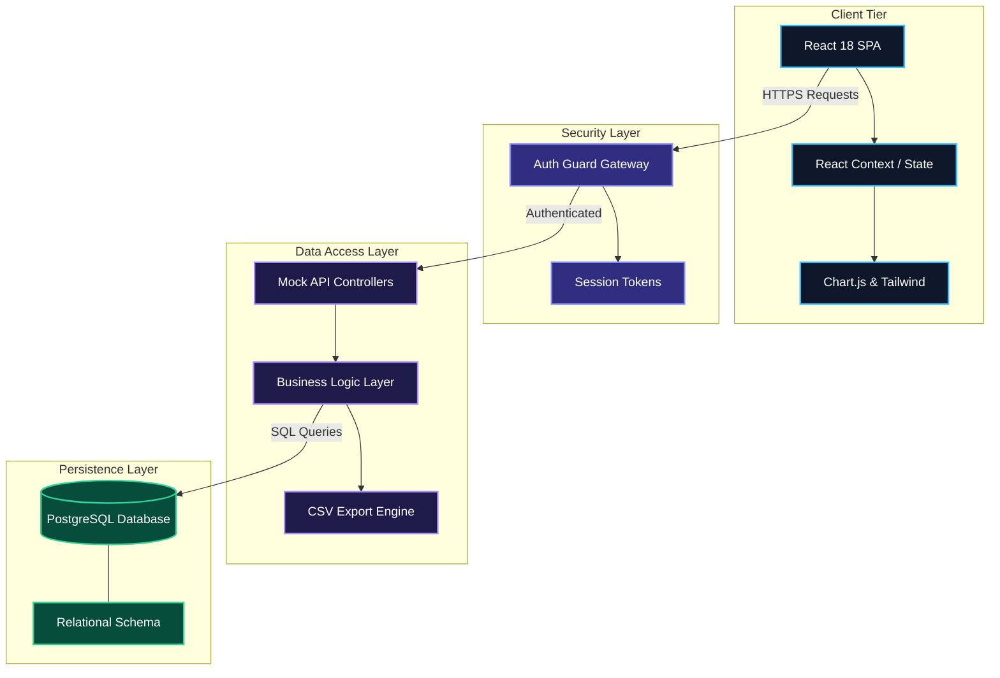
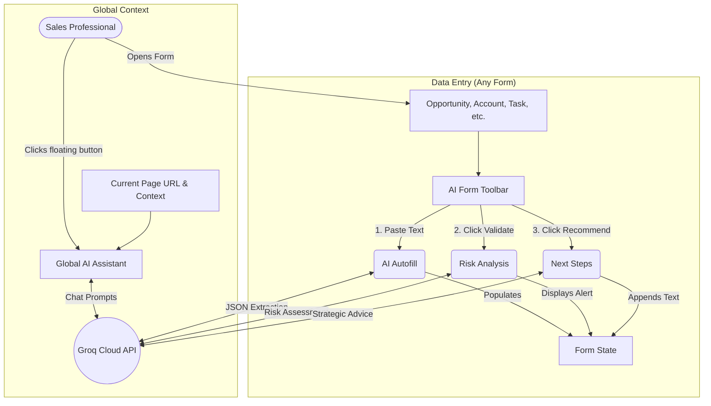

<div align="center">

  

# ALT-S Presales Command Center

**Enterprise-Grade Lifecycle Management for Presales & Bid Operations**

[](https://reactjs.org/)
[](https://www.typescriptlang.org/)
[](https://tailwindcss.com/)
[](https://www.postgresql.org/)

  <br />

_[Read the Documentation](./docs/USER_GUIDE.md) · [Report Bug](#) · [Request Feature](#)_

</div>

---

## Executive Summary

The **ALT-S Presales Command Center** is a state-of-the-art, high-performance web application engineered to consolidate and automate the entire presales pipeline. Built for enterprise scale, it aggregates critical operations—from pipeline visualization and deal tracking to RFx bid management—into a single, highly secure pane of glass.

<br />

<div align="center">
  
  
  
  
</div>

<br />

## System Architecture

Our highly decoupled microservices architecture ensures seamless scalability under heavy enterprise workloads. Below is the data-flow and infrastructure blueprint:



---

## AI Feature Integration Flow

The Groq AI engine (`llama-3.3-70b-versatile`) has been woven into both the global application state and the specific data-entry points.



### AI Capabilities Breakdown

1. **Global AI Assistant (`AIAssistantWidget`)**
   - **Trigger**: Floating action button on every page.
   - **Context**: Ingests `window.location.pathname` to understand what the user is looking at.
   - **Action**: Provides real-time chat assistance regarding pre-sales methodologies, bid strategies, or general navigation help.

2. **AI Form Toolbar (`AIFormToolbar`)**
   - **Trigger**: Injected at the top of every entity form (`OpportunityForm`, `AccountForm`, etc.).
   - **Actions**:
     - **Autofill**: Takes unstructured text (emails, call transcripts), sends a prompt requesting structured JSON mapping to the specific form's schema, and auto-populates the React state.
     - **Risk Analysis**: Serializes the current form state to JSON and sends it to the LLM to analyze for missing deadlines, overly optimistic win probabilities, or missing critical stakeholders.
     - **Recommendations**: Analyzes the current deal size and stage to formulate 2-3 concise, tactical next steps, auto-appending them to the form's text areas.

---

## Core Capabilities

> **Intelligent Dashboarding**  
> Aggregated view of Total ARR, Weighted Pipeline calculations, and actionable KPIs driven by real-time analytics.

> **Advanced Opportunity Management**  
> High-fidelity, horizontally scaling data grids with complex stage tracking (RFP/RFI Management to Closed Won/Lost), integrated search, and raw CSV exports.

> **Entity Centralization**  
> Unified repository for Account hierarchy mapping and Contact intelligence, preventing CRM data silos.

> **Zero-Trust Security Gateway**  
> Fully animated, premium authentication flow that forcefully intercepts unauthorized routing attempts.

---

## Technical Implementation Details

### Responsive & Fluid UI

Engineered with a **mobile-first methodology**. Complex data tables utilize intelligent scroll-wrappers and flex-box shrink constraints to maintain viewport integrity on smaller devices, while side navigation transforms into a buttery-smooth slide drawer.

### Premium Micro-Interactions

The UI is heavily populated with micro-animations—from the glassmorphism login fade to glowing active inputs and pulse-indicators—ensuring a SaaS-grade tactile feel that boosts user engagement.

---

## Quick Start

### Prerequisites

- **Node.js** (v18.x LTS or higher)
- **NPM** or **Yarn**

### Initialization

1. **Clone the Repository**

   ```bash
   git clone https://github.com/VaishalMalu/ALT-S-Presales-Command-Center.git
   cd ALT-S-Presales-Command-Center
   ```

2. **Install Dependencies**

   ```bash
   npm install
   ```

3. **Ignite the Development Server**

   ```bash
   npm run dev
   ```

4. **Authenticate**
   Access `http://localhost:5173` and authenticate using the corporate credentials:
   - **ID**: `admin@alt-s.com`
   - **Password**: `admin`

---

## Enterprise Compliance

**Copyright © 2026 ALT-S Corporation. All rights reserved.**

This software repository and its associated documentation files are proprietary, confidential, and classified as trade secrets. Unauthorized duplication, reverse engineering, distribution, or reproduction via any medium is strictly prohibited and subject to legal prosecution.
